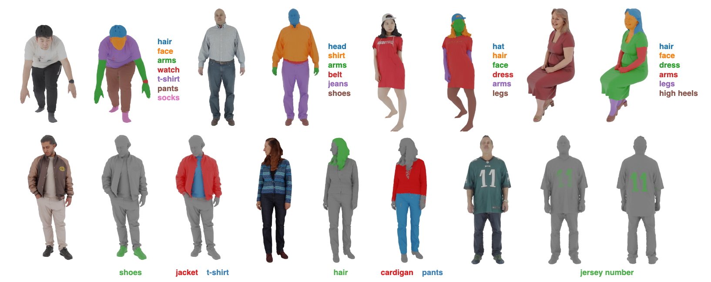

# Open-Vocabulary Semantic Part Segmentation of 3D Human (3DV 2025)
This is the official repository for the paper **["Open-Vocabulary Semantic Part Segmentation of 3D Human"](https://arxiv.org/pdf/2502.19782)**.


Clone our repository:
```bash
git clone https://github.com/otiek/OpenHuman3D.git
cd OpenHuman3D
```
## Installation
Create a conda environment:
```bash
conda create -n openhuman3d python=3.10
conda activate openhuman3d
```

Install [pytorch](https://pytorch.org/get-started/previous-versions/) and [pytorch3d](https://github.com/facebookresearch/pytorch3d/blob/main/INSTALL.md). 
We tested our code on pytorch 2.1.0 and pytorch3d 0.7.5 with CUDA 12.1 on a single RTX 4090 GPU, but other versions should work as well. For example:
```bash
pip install torch==2.1.0+cu121 torchvision==0.16.0+cu121 torchaudio==2.1.0+cu121 --index-url https://download.pytorch.org/whl/cu121
pip install pytorch3d -f https://dl.fbaipublicfiles.com/pytorch3d/packaging/wheels/py310_cu121_pyt210/download.html
```
Install SAM:
```bash
pip install git+https://github.com/facebookresearch/segment-anything.git
```
Install other requirements via:
```bash
pip install -r requirements.txt
```

## Checkpoints
```bash
mkdir checkpoints
```
HumanCLIP: The checkpoint for the "ViT-L/14" model can be downloaded from this [link](https://drive.google.com/file/d/1XGVLXfO33gs4Jib9EYQ0frQTolXNg3Qc/view?usp=drive_link). Place 'humanclip.pth' under the 'checkpoints' directory.
SAM: Download the ['sam_vit_h_4b8939'](https://dl.fbaipublicfiles.com/segment_anything/sam_vit_h_4b8939.pth) checkpoint and place under the 'checkpoints' directory.

## Inference
This is an example inference script for some samples from the THuman dataset. For your own mesh, please follow the config file and adjust the mesh paths and input class texts.
1. Render multi-view images and generate SAM masks for each view.
```bash
python generate_masks.py --config configs/0520.yaml
```
2. Compute embeddings for each mask.
```bash
python compute_mask_embeddings.py --config configs/0520.yaml
```
3. Segment the 3D points based on the input class texts.
```bash
python segment.py --config configs/0520.yaml
```

## Citation
If you find our work helpful for your research, please consider citing:
```bibtex
@misc{suzuki2025open,
      title={Open-Vocabulary Semantic Part Segmentation of 3D Human}, 
      author={Keito Suzuki and Bang Du and Girish Krishnan and Kunyao Chen and Runfa Blark Li and Truong Nguyen},
      year={2025},
      eprint={2502.19782},
      archivePrefix={arXiv},
      primaryClass={cs.CV}
}
```